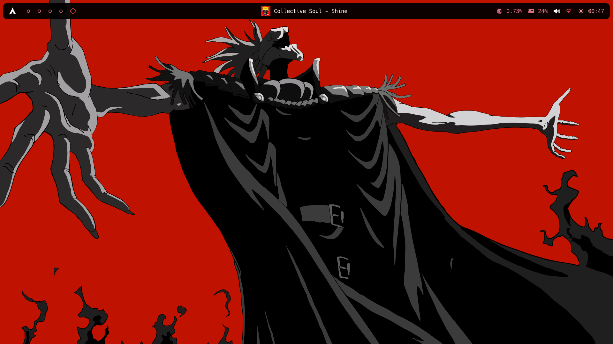
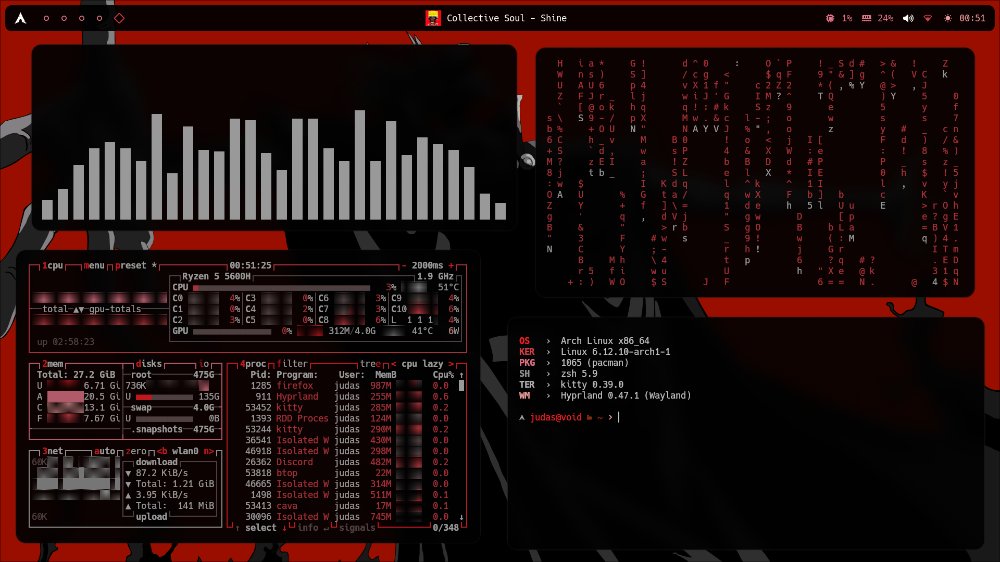

# Judas Hyprland

Welcome to **Judas Hyprland**!

Thank you for visiting my Hyprland rice. I hope you like my configuration whether you're a power user or just starting out, I hope this rice brings an aesthetic and functional boost to your workflow.

I will soon add a install script for this rice, but for now you can only clone the config files and use them so long as you have the correct dependices as I do.

## Details

- OS: **[Arch Linux](https://github.com/archlinux)**
- DE: **[Hyprland](https://github.com/hyprwm/Hyprland)**
- Terminal: **[Kitty](https://github.com/kovidgoyal/kitty)**
- Music Player: **[ncspot](https://github.com/hrkfdn/ncspot)**
- Shell: **[zsh](https://github.com/zsh-users/zsh)**
- Bar: **[waybar](https://github.com/Alexays/Waybar)**
- App Launcher: **[Rofi](https://github.com/davatorium/rofi)**
- File Manager: **[yazi](https://github.com/sxyazi/yazi)**

This rice utilized pywal to create custom colorscemes depending on the wallpaper used.

## Screenshots

## Credits
- **[Haya2](https://www.youtube.com/watch?v=X5o3bLyeIG4&list=LL&index=4)**
- **[adi1090x](https://github.com/adi1090x/rofi)**
